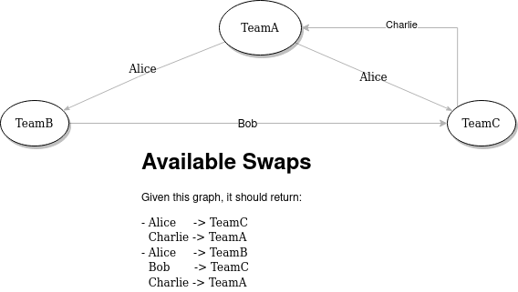

# Team Swapper

## Introduction

Given a group of teams and people working in those, this tool aims to help on the had task to organize and coordinate team changes.

In some circumstances, team members would appreciate a team change but they would prefer to keep this information secret and only be accessible in need-to-know basis.
This tool's objectives are:

- Find potential team swaps, which can be direct 2-way swap or n-way swaps
- System will keep open change requests invisible until there is a potential match
- Only managers would be able to retrieve potential team swaps
- Managers would decide which team swap is the best

This tool will not:

- Collect skills and try to do matchmaking
- Prioritize team swaps in any metric

## Architecture

The application is a web based server (using Akka HTTP). A manager needs to first setup the team with their members in the tool. It is not planned to do "read from file" imports.
Once the teams are configured, each team member would get an individual token (the manager is in charge to share this token) which will be used to access the API and request actions on their behalf.
The scope of this application is not to implement any authentication mechanism.

The business logic is backed by Akka Actors. There are a total of 2 types of actors:

### TeamHandler

This actor is the one in charge of maintaining the team structure in memory and create the Team Actors (explained below). This actor is the entry point for the HTTP end points.

### Team

There is an instance of this actor per team, and the purpose of this actor is to look for potential team swaps. In order to achieve this, each actor will store change requests, which consist of a team member and a destination team.
On demand (it might be also an scheduled taks) the system will check for potential team swaps. To find those, each actor will send a probe to all the other Team actors it knows (through the tream change requests). A potential team swap is found when the probe comes back to the actor that originated such search. In other words, the Team actors are organized in a directed graph fashion, and a potential team swap is a cycle. Please note that all the edges are labelled with the team member who requested the move. This means that _Team A_ actor might have more than 2 references to _Team B_ actor if more than one person requested such change.

See the following illustration showcasing this:

## Simplification

In order to not overcomplicate the Actor protocol, the _TeamHandler_ actor will hold the team structure (membership) in memory. This could be hold by a different actor (or set of actors), but it would also mean that obtaining team membership would become an asynchronous query, increasing the complexity of the protocol unnecessarily.
